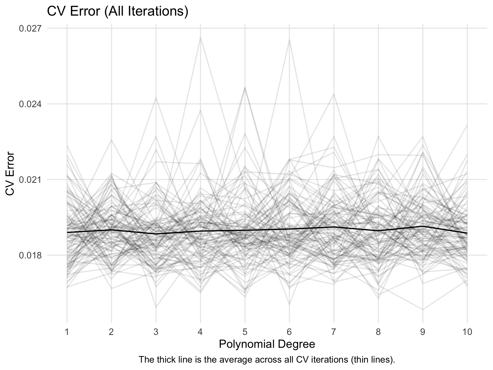
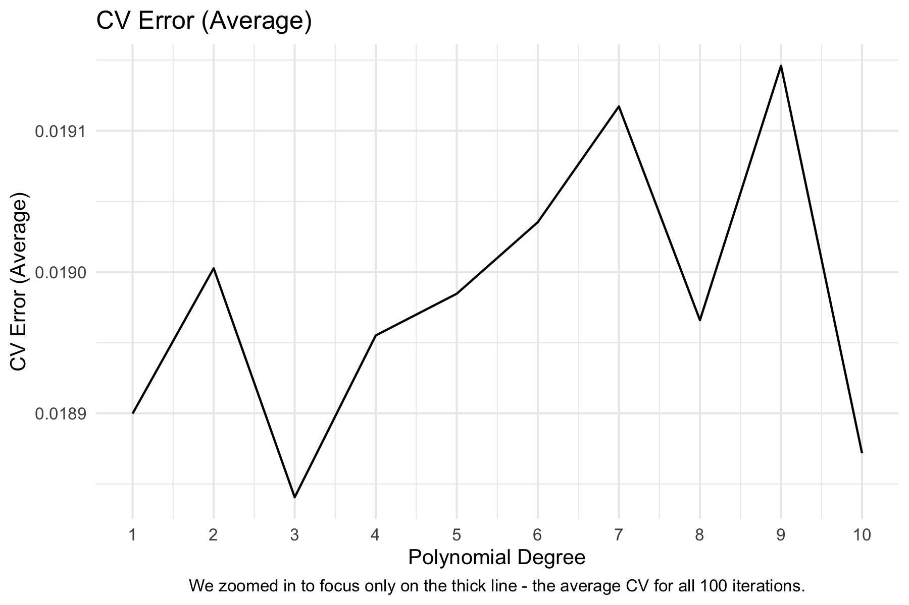
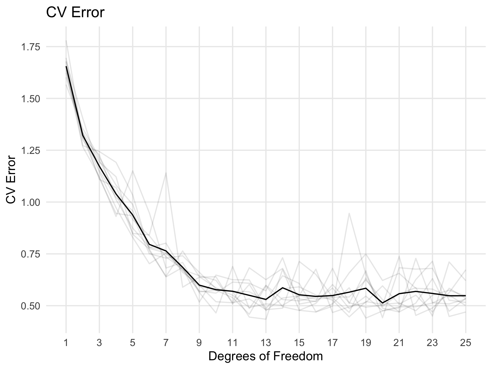
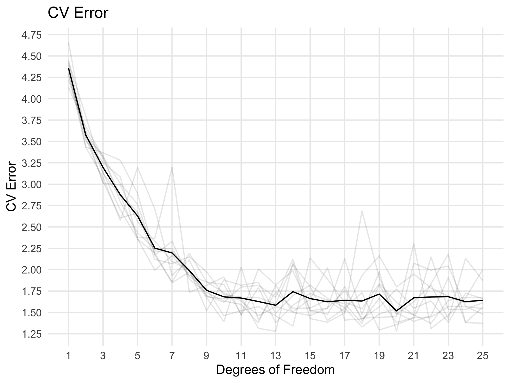
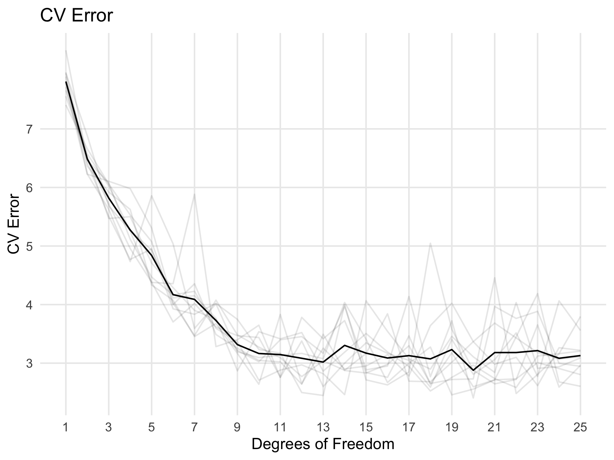

```{r setup, include=FALSE, echo=FALSE, warning=FALSE, message=FALSE}
knitr::opts_chunk$set(echo = FALSE)
```
<style type="text/css">

body{ /* Normal  */
      font-size: 10px;
  }
td {  /* Table  */
  font-size: 7px;
}
h1.title {
  font-size: 32px;
  color: DarkRed;
}
h1 { /* Header 1 */
  font-size: 24px;
  color: DarkBlue;
}
h2 { /* Header 2 */
    font-size: 18px;
  color: DarkBlue;
}
h3 { /* Header 3 */
  font-size: 14px;
  font-family: "Times New Roman", Times, serif;
  color: DarkBlue;
}
code.r{ /* Code block */
    font-size: 10px;
}
pre { /* Code block - determines code spacing between lines */
    font-size: 12px;
}
</style>

### Introduction

This report is authored by **Matthew Cui, Phillip Harmadi, Glen Morgenstern, Joe Wang, Gaurav Sirdeshmukh,** and **Gautam Sirdeshmukh.**

### Methodology

```{r echo=FALSE, message=FALSE}
library(tidyverse)
library(car)
library(boot)
library(gam)
library(splines)
train <- read_csv("data-train.csv")
test <- read_csv("data-test.csv")
cor(train)
```

```{r eda}
# We transform the variables using the sigmoid function so that this variable 
# will be within a finite range.

train1 <- train %>%
  rename(M1 = R_moment_1, M2 = R_moment_2, M3 = R_moment_3, M4 = R_moment_4) %>%
  mutate(Fr_sigmoid = 1 / (1 + exp(-Fr)),
         Re_sigmoid = 1 / (1 + exp(-Re)),
         M1_sigmoid = 1 / (1 + exp(-M1)),
         M2_sigmoid = 1 / (1 + exp(-M2)),
         M3_sigmoid = 1 / (1 + exp(-M3)),
         M4_sigmoid = 1 / (1 + exp(-M4))) %>%
  mutate(Re_categorical = case_when(Re == 90 ~ "Low", Re == 224 ~ "Medium", Re == 398 ~ "High"),
         Fr_categorical = case_when(Fr == 0.052 ~ "Low", Fr == 0.3 ~ "Medium", Fr == Inf ~ "High"))

test1 <- test %>%
  mutate(Fr_sigmoid = 1 / (1 + exp(-Fr)),
         Re_sigmoid = 1 / (1 + exp(-Re))) %>%
  mutate(Re_categorical = case_when(Re == 90 ~ "Low", Re == 224 ~ "Medium", Re == 398 ~ "High"),
         Fr_categorical = case_when(Fr == 0.052 ~ "Low", Fr == 0.3 ~ "Medium", Fr == Inf ~ "High"))

train1
test1
```

#### Quick Overview


{#id .class width=40% height=40%}
{#id .class width=40% height=40%}
{#id .class width=33% height=33%}
{#id .class width=33% height=33%}
{#id .class width=33% height=33%}

### Results

#### Final Models

```{r}
M1 <- lm(log(M1) ~ St + Re_categorical + Fr_categorical, data = train1)
summary(M1)
```


```{r}
M2 <- gam(log(M2) ~ s(St, df = 9) + Re_categorical + Fr_categorical + 
                   Re_categorical * Fr_categorical, data = train1)
summary(M2)

```

```{r}
M3 <- gam(log(M3) ~ s(St, df = 9) + Re_categorical + Fr_categorical + 
                   Re_categorical * Fr_categorical, data = train1)
summary(M3)
```

```{r}
M4 <- gam(log(M4) ~ s(St, df = 9) + Re_categorical + Fr_categorical + 
                   Re_categorical * Fr_categorical, data = train1)
summary(M4)
M4 <- gam(log(M4) ~ s(St, df = 9) + Re_categorical + Fr_categorical + 
                   Re_categorical * Fr_categorical, data = train1)
summary(M4)
```

```{r}
M2.resid <- resid(M2)
M2.fitted <- fitted(M2)
M2_resid_vs_fitted <- data.frame(M2.fitted,M2.resid) 
M2_resid_vs_fitted %>%
  ggplot(mapping = aes(x = M2.fitted, y = M2.resid)) +
  geom_point() + geom_smooth() + labs(title = "M2 Diagnostics fitted vs resid") + theme_minimal()
M3.resid <- resid(M3)
M3.fitted <- fitted(M3)
M3_resid_vs_fitted <- data.frame(M3.fitted,M3.resid) 
M3_resid_vs_fitted %>%
  ggplot(mapping = aes(x = M3.fitted, y = M3.resid)) +
  geom_point() + geom_smooth() + labs(title = "M3 Diagnostics fitted vs resid") + theme_minimal()
M4.resid <- resid(M4)
M4.fitted <- fitted(M4)
M4_resid_vs_fitted <- data.frame(M4.fitted,M4.resid) 
M4_resid_vs_fitted %>%
  ggplot(mapping = aes(x = M4.fitted, y = M4.resid)) +
  geom_point() + geom_smooth() + labs(title = "M4 Diagnostics fitted vs resid") + theme_minimal()
```

```{r, warning=FALSE}
M1_Predict <- as.data.frame(predict(M1, test1))
M1_Predict <- M1_Predict %>%
  mutate(fit.exp = exp(M1_Predict$`predict(M1, test1)`))
M2_Predict <- as.data.frame(predict(M2, test1))
M2_Predict <- M2_Predict %>%
  mutate(M2_exp = exp(M2_Predict$`predict(M2, test1)`))
M3_Predict <- as.data.frame(predict(M3, test1))
M3_Predict <- M3_Predict %>%
  mutate(M3_exp = exp(M3_Predict$`predict(M3, test1)`))
M4_Predict <- as.data.frame(predict(M4, test1)) 
M4_Predict <- M4_Predict %>%
  mutate(M4_exp = exp(M4_Predict$`predict(M4, test1)`))

m1_predictions <- M1_Predict$fit.exp
m2_predictions <- M2_Predict$M2_exp
m3_predictions <- M3_Predict$M3_exp
m4_predictions <- M4_Predict$M4_exp

data_test <- data.frame(m1_predictions, m2_predictions, m3_predictions, m4_predictions)
data_test_prediction <- cbind(test, data_test)
write_csv(data_test_prediction,"data_test_prediction.csv")
```


### Conclusion


### Appendix

Appendix 1


```{r fig.width=6, fig.height=6}
plot(M1, which = 1)
plot(M1, which = 2)
plot(M1, which = 3)
plot(M1, which = 4)
```

